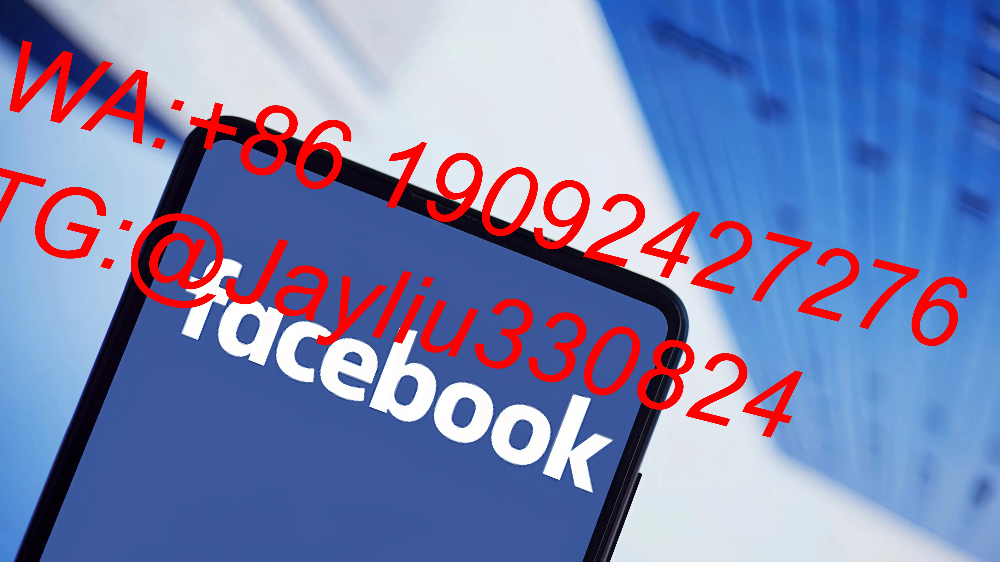
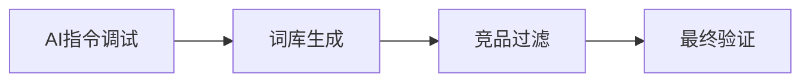

# Facebook广告效能提升实战教程

---

## 一、智能分层运营策略

### 1.1 多维受众管理
| 受众类型 | 构建参数 | 激活方式 | 优化周期 |
|----------|----------|----------|----------|
|核心受众|ChatGPT生成300+种子关键词|动态广告模板|72小时扫描更新|
|高价值受众|成交TOP50客户特征提取|精准定向推送|实时行为触发|
|休眠唤醒|30天未转化客户追踪|定制优惠激励|每日22:00更新|

### 1.2 兴趣词管理工程

- **动态优化指标**：组内关键词CTR差异值≤0.25
- **排除机制**：CPM同比增幅≥15%立即禁用

---

## 二、素材科学实验体系

### 2.1 模块化测试流程
| 阶段 | 配置要求 | 考核周期 | 优化动作 |
|------|----------|----------|----------|
|初始验证|$50预算/组×12组|24小时|淘汰5秒播放率＜68%|
|深度优化|$100预算/组×6组|48小时|保留下单率≥5%|

### 2.2 文案基因重组
| 要素 | 视频脚本 | 图文组合 | 轮播方案 |
|------|----------|----------|----------|
|首帧策略|痛点提问+数据冲击|前3词吸引力法则|悬念制造|
|中场递进|场景对比+用户证言|功能参数可视化|阶梯呈现|
|结尾触发|倒计时+专属编码|CTA按钮动态变色|库存警示|

---

## 三、智能预算调控矩阵

### 3.1 动态分配系统
| 时段 | 核心任务 | 分配公式 | 限制条件 |
|------|----------|----------|----------|
|07:00-11:00|新客获取|基础预算×1.5|单组限额$80|
|12:00-15:00|深度互动|0.7×上午有效预算|ROAS＞2.5|
|16:00-19:00|再营销|日预算剩余×0.6|仅开放相似受众|
|20:00-23:00|数据整备|预算冻结|次日策略生成|

### 3.2 异常止损机制
- **CTR防护**：连续3小时降幅＞25%触发自动换图
- **CPA管控**：超出设定值30%进入人工会审
- **频次调控**：用户曝光超3次自动暂停投放

---

## 四、AI增效工具链

### 4.1 智能应用矩阵
| 工具类型 | 核心功能 | 应用场景 | 效能提升 |
|----------|----------|----------|----------|
|指令生成器|Prompt精准调试|兴趣词扩展|40%效率提升|
|文案生成器|多模型自动适配|广告文案创作|创作周期缩短65%|
|数据诊疗台|异常特征识别|账户健康监测|问题发现效率提高3倍|

---

## 五、用户旅程优化方案

### 5.1 全触点运营设计
| 用户阶段 | 行为特征 | 广告形式 | 权益配置 |
|----------|----------|----------|----------|
|认知期|<5秒页面停留|品牌故事广告|免费样申领|
|考察期|商品页比较跳转|对比测评广告|专属优惠券|
|决策期|重复加入购物车|动态折扣广告|限时免运费|
|沉默期|15天无交互|挽回专案广告|老客焕新礼|

---

## 六、团队风控机制

### 6.1 审计验证标准
| 操作类型 | 审批层级 | 文档要求 | 追溯期限 |
|----------|----------|----------|----------|
|预算变更|三级复核|ROI预测报表|留存90天|
|素材更新|双人验证|合规检查清单|永久存档|
|账户调整|CTO核准|风险评估报告|关联事件链|

---

**实施案例验证：**
某家居品牌6周运营数据：
🔼 素材点击率提升至3.8%
🔽 CPM稳定在$9.2区间
⏫ 首周复购率突破22%
⏱ 平均决策耗时缩短58%

建议配备热力点击图监测工具，建立每日凌晨3点自动生成优化报告机制。新品上市需提前构建流量储备池。
[教学视频](https://youtube.com/shorts/gSdqdM-Pf-o?feature=share)
